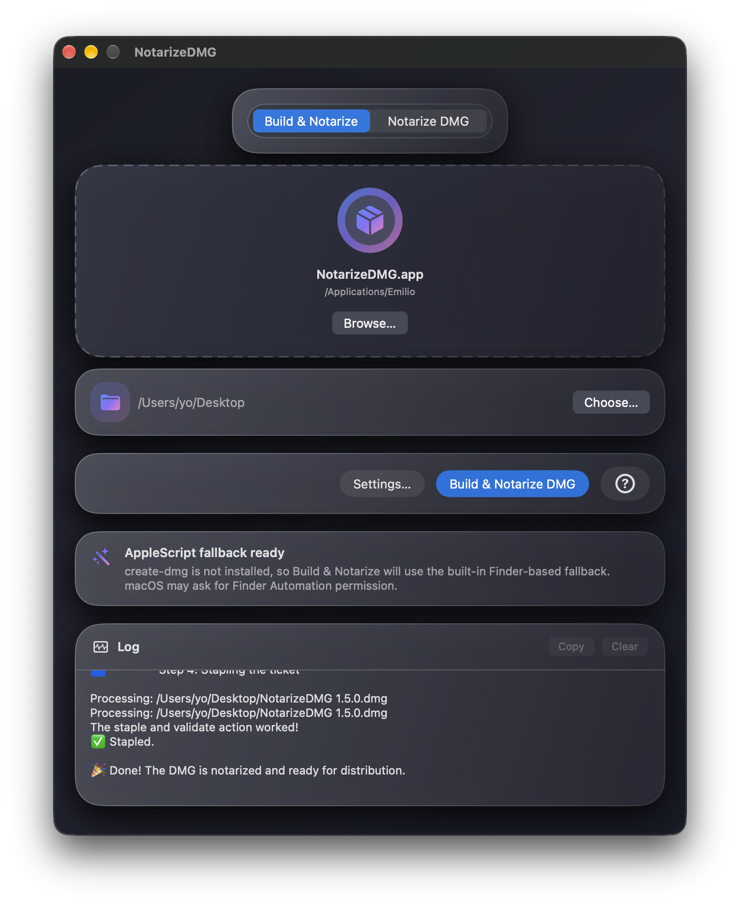
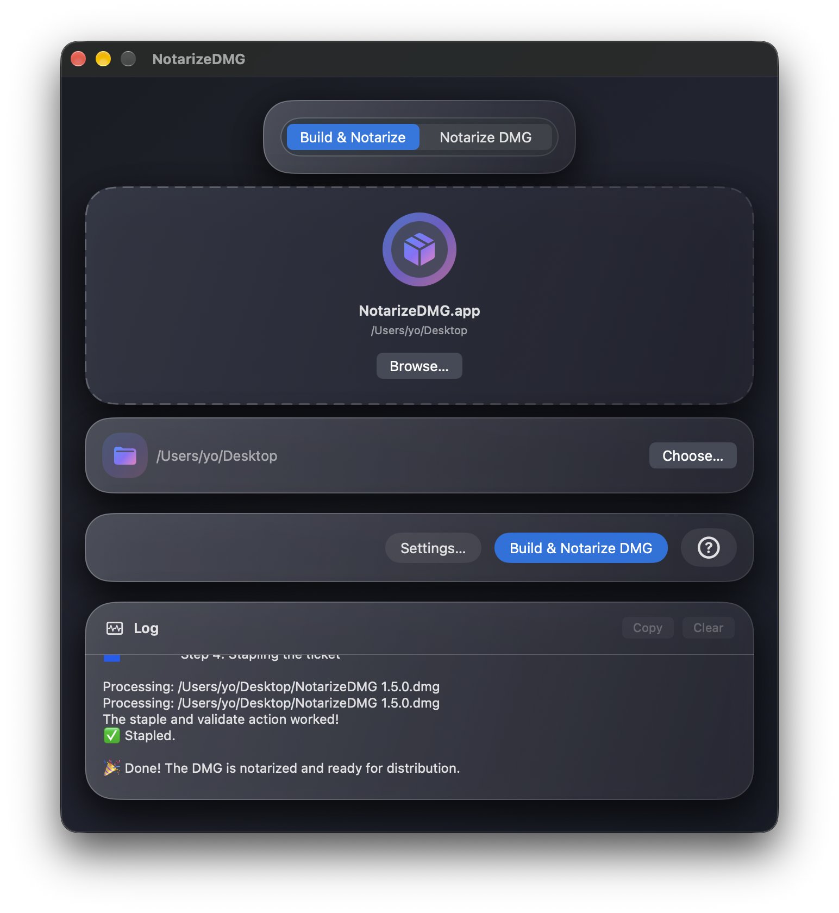
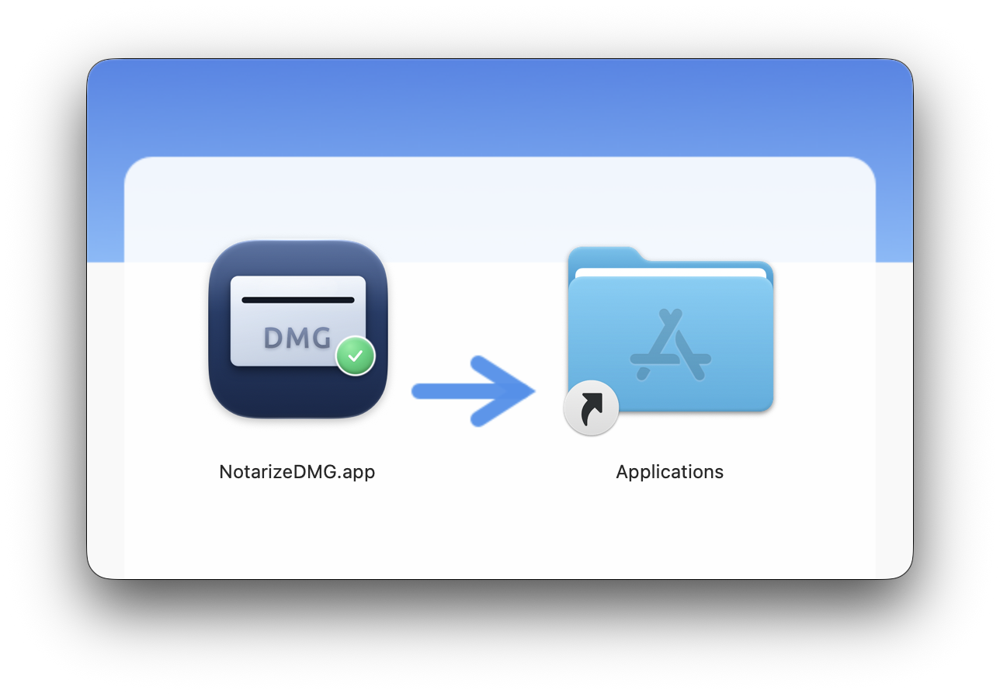
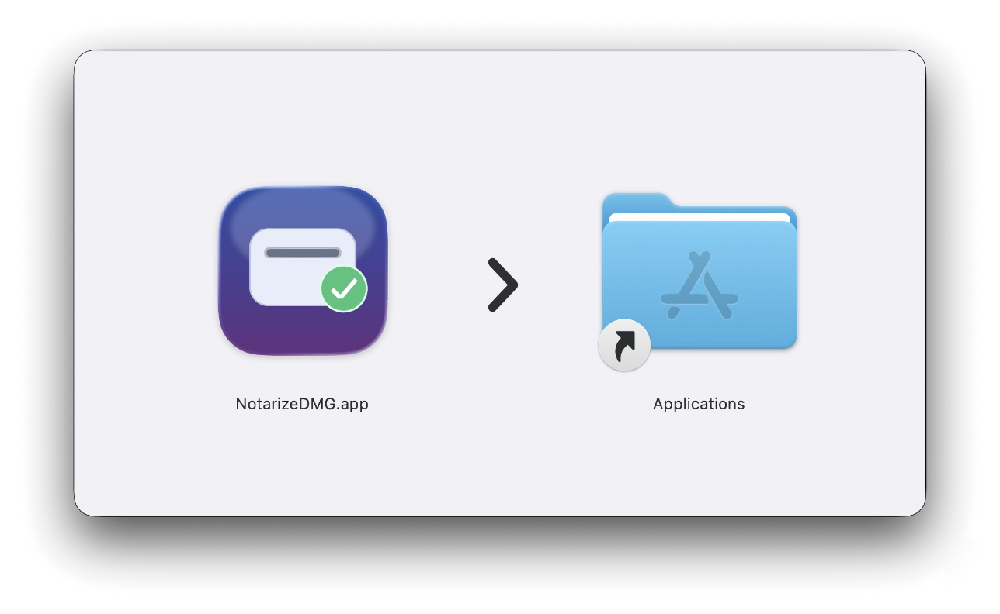

# NotarizeDMG


<!-- [](README.md) -->

  <p align="center">
     
  </p>

NotarizeDMG es una utilidad SwiftUI para macOS que notariza con Apple una imagen DMG firmada o sin firmar, todo desde una sola ventana. En el modo **Crear y notarizar DMG**, prefiere `create-dmg` cuando está disponible y recurre a un flujo integrado con AppleScript + Finder cuando no lo está.

| AppleScript |
|:----|
|  |

| create-dmg |
|:----|
|  | 

## Características

| | |
|---|---|
| **Dos modos** | **Notarizar DMG** — firma y notariza un `.dmg` existente. **Crear y notarizar DMG** — crea una DMG a partir de una `.app`, y luego la firma y la notariza usando `create-dmg` cuando está instalado o AppleScript + Finder como alternativa. |
| **Arrastrar y soltar** | Arrastra una `.dmg` o `.app` a la ventana, o usa *Examinar…* para localizarla. |
| **Carpeta de salida** | En el modo Crear y notarizar DMG, elige la carpeta donde se guardará la DMG resultante. La selección se recuerda entre sesiones. |
| **Acción con un clic** | Ejecuta `codesign`, `xcrun notarytool submit --wait` y `xcrun stapler staple` en secuencia (precedidos por `create-dmg` o por el generador DMG integrado basado en AppleScript en el modo Crear y notarizar DMG). |
| **Cancelar** | Detén una operación en curso en cualquier momento con el botón *Cancelar*. |
| **Registro en tiempo real** | La salida de los comandos fluye en tiempo real a un área de registro desplazable, con botones *Copiar* y *Limpiar*. |
| **Credenciales seguras** | Apple ID, Team ID, identidad de firma y contraseña específica de la app se almacenan como un único elemento JSON en el Llavero del sistema, nunca en texto plano. |
| **Panel de ajustes** | Ábrelo con el botón *Ajustes…* o con ⌘, para introducir o actualizar credenciales. |
| **Panel de ayuda** | Ayuda integrada sobre ambas rutas de creación de DMG y la instalación de `create-dmg`, accesible con el botón **?**. |
| **Sistema de idiomas** | Inglés (predeterminado), español, francés, alemán e italiano. Cámbialo desde el menú *Idioma* (⌘L). |

## Complemento

NotarizeDMG requiere un archivo DMG (firmado digitalmente o no) como origen. Esa DMG contiene una aplicación macOS firmada digitalmente con un certificado **Developer ID Application** de Apple. Hay varias formas de crear la imagen DMG, incluidas herramientas integradas de macOS, pero cuando abres la DMG en la ventana del Finder, su diseño es muy básico, con una ventana grande e iconos pequeños.

Para crear fácilmente una imagen DMG con un aspecto más elegante, me gusta la herramienta gratuita de línea de comandos [create-dmg](https://github.com/sindresorhus/create-dmg) de *Sindresorhus*.

NotarizeDMG añade integración con `create-dmg` mediante un modo **Crear y notarizar DMG** que delega la creación de la DMG en el CLI npm `create-dmg` ya instalado por el usuario cuando está disponible y, en caso contrario, recurre a un flujo integrado con AppleScript + Finder.

Muchos proyectos usan AppleScript para generar imágenes DMG con ventanas personalizadas del Finder, pero tiene algunas desventajas:

- No siempre funciona bien en todas las versiones compatibles de macOS
- AppleScript requiere que el usuario conceda permisos en Privacidad y seguridad → Automatización
- Aplicar el diseño a la ventana de la DMG es bastante lento.

Cuando `create-dmg` está instalado, NotarizeDMG usa esa ruta más rápida y evita por completo el permiso de Automatización de Finder. Cuando no lo está, la app sigue funcionando mediante la alternativa integrada con AppleScript, aunque macOS puede solicitar permiso de Automatización para Finder.

El requisito previo para disponer de `create-dmg` es tener instalado Node.js 20 o posterior. Una forma de instalar Node es mediante el gestor de paquetes Homebrew. Aunque es un paso adicional frente a instalar Node directamente desde su propio instalador, puede ayudarte a evitar errores de permisos y otros problemas.

1.- Instalar Homebrew:

```bash
/bin/bash -c "$(curl -fsSL https://raw.githubusercontent.com/Homebrew/install/HEAD/install.sh)"
```

2.- Instalar Node:

`brew install node`

3.- Instalar create-dmg:

- Ejecuta en Terminal<br>`npm install --global create-dmg`
- Opcional: si recibes un mensaje sobre<br>`allow-scripts=fs-xattr,macos-alias`<br>ejecuta<br>`npm config set allow-scripts=fs-xattr,macos-alias --location=user`
- `create-dmg` suele estar disponible en `/usr/local/bin/create-dmg` (Mac Intel) o `/opt/homebrew/bin/create-dmg` (Mac con Apple Silicon)
- Como beneficio adicional, la imagen DMG se firma digitalmente si no lo estaba previamente.

La imagen DMG creada tiene un diseño elegante que me gusta mucho y el proceso es realmente rápido:

- 2 iconos: la app y el enlace a Aplicaciones
- iconos de mayor tamaño
- fondo que indica arrastrar la app al enlace Aplicaciones
- tamaño de ventana ajustado al fondo
- el icono de la imagen de disco abierta tiene integrado el icono de la aplicación.

| AppleScript |
|:----|
|  |

| create-dmg |
|:----|
|  | 

### Notas

- Prueba la aplicación «tal cual», sin instalar `create-dmg`. Si obtienes archivos DMG con un diseño atractivo de la ventana del Finder, quédate con esa opción. Si los DMG presentan el diseño básico y poco estético típico de las DMG estándar, instala `create-dmg`: el proceso de creación de la DMG es considerablemente más rápido, no necesitas conceder permisos de automatización y las imágenes DMG siempre presentan un diseño de ventana del Finder mejorado.
- La primera vez que ejecutes la aplicación en modo AppleScript, aparecerá un aviso informando al usuario de que «DMGBuildNotarize utiliza la automatización del Finder para crear diseños personalizados de ventanas de instalación» y solicitando permiso para que DMGBuildNotarize envíe eventos Apple (`Apple Events`) al Finder. Debes conceder este permiso para que la DMG se cree correctamente. Esto no es necesario si la DMG se crea en modo `create-dmg`.
- ¿Por qué es diferente el fondo de la ventana del Finder de la DMG? 
   - AppleScript: el fondo de la ventana se genera mediante código; lo que ves es el resultado de ajustes basados en prueba y error hasta encontrar uno válido.
  - create-dmg: el fondo está integrado como imagen dentro de la herramienta; dado que `create-dmg` se utiliza en muchos proyectos diferentes, preferí mantener el fondo original tal y como lo implementó su creador, *sindresorhus*.

## Ayuda de create-dmg

Si la app no detecta `create-dmg` en el sistema, el modo Crear y notarizar DMG cambia automáticamente a la alternativa integrada con AppleScript y la interfaz explica que Finder puede solicitar permiso de Automatización. El icono de ayuda (?) muestra una ventana informativa sobre las dos rutas de creación de DMG y la instalación de `create-dmg`.

## Ajustes

La ventana de configuración agrupa los siguientes ajustes en un solo lugar:

- Firma de código y cuenta de Apple Developer
- Opción para eliminar los archivos DMG tras la cancelación
- La ventana de selección de idioma permanece como un ajuste independiente.

## Requisitos

- macOS 14 Sonoma o posterior
- Xcode 16 o posterior
- Una cuenta de Apple Developer con un certificado **Developer ID Application**
- Una **contraseña específica de la app** generada en [appleid.apple.com](https://appleid.apple.com)

## Primeros pasos

1. Abre `NotarizeDMG.xcodeproj` en Xcode.
2. En el editor del proyecto, configura el campo **Team** (equipo) en *Signing & Capabilities*.
3. Compila y ejecuta (`⌘R`).
4. Haz clic en **Ajustes…** (o pulsa ⌘,) y completa:
   - **Signing Identity** — la cadena completa de Acceso a Llaveros; por ejemplo, `Developer ID Application: Tu Nombre (XXXXXXXXXX)`
   - **Apple ID** — el correo de tu Apple ID de desarrollador
   - **Team ID** — tu identificador de equipo de 10 caracteres
   - **App-Specific Password** — generada en appleid.apple.com
5. Guarda (las credenciales se almacenan en el Llavero del sistema).
6. Modos:
   - **Modo Notarizar DMG:** arrastra (o busca) una `.dmg` y luego haz clic en **Notarizar**
   - **Modo Crear y notarizar DMG:** arrastra (o busca) una `.app`, elige una carpeta de salida y luego haz clic en **Crear y notarizar DMG**.

## Flujo de notarización

### Modo Notarizar DMG

La app ejecuta los siguientes comandos en orden:

```bash
# 1. Firmar la DMG con una marca de tiempo segura (se omite si ya está firmada)
codesign --sign "<Signing Identity>" --timestamp "<ruta/al/archivo.dmg>"

# 2. Enviar a Apple y esperar el resultado
xcrun notarytool submit "<ruta/al/archivo.dmg>" \
    --apple-id  "<Apple ID>" \
    --password  "<App-Specific Password>" \
    --team-id   "<Team ID>" \
    --wait

# 3. Adjuntar el ticket de notarización a la DMG
xcrun stapler staple "<ruta/al/archivo.dmg>"
```

### Modo Crear y notarizar DMG

Antes del flujo de notarización, la app intenta localizar automáticamente `create-dmg` en el sistema.

Si `create-dmg` está disponible, se ejecuta primero este paso 0 y luego los pasos 1–3 anteriores:

```bash
# 0. Crear una DMG a partir del paquete .app
create-dmg "<ruta/a/App.app>" "<carpeta-de-salida>"

# Pasos 1–3: firmar, notarizar y adjuntar el ticket a la DMG resultante
```

Si la app no encuentra `create-dmg`, NotarizeDMG monta una DMG temporal editable, aplica el diseño de la ventana del Finder con AppleScript, comprime la imagen y continúa con la firma, la notarización y el grapado.

## Notas de seguridad

- App Sandbox está **desactivado** (`com.apple.security.app-sandbox = false`). Esto es necesario para que la app pueda invocar `codesign`, `xcrun`, `create-dmg`, `hdiutil` y la automatización de Finder como operaciones hijas.
- Las cuatro credenciales se almacenan como un único elemento JSON en el Llavero del sistema bajo el nombre de servicio `perez987.notarizedmg` usando `kSecAttrAccessibleWhenUnlocked`. Nunca se escriben en disco en texto plano.
- El campo de contraseña de la app usa `SecureField` y nunca se registra en el log.
- Los elementos heredados del Llavero (de versiones anteriores) se migran automáticamente al formato combinado en el primer arranque y luego se eliminan.
