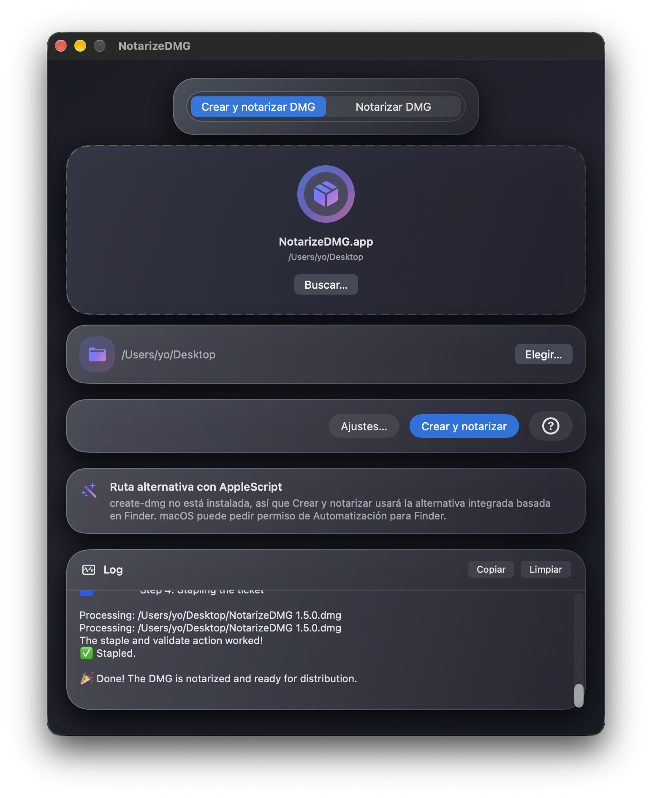

# NotarizeDMG


<!-- [](README.md) -->

  <p align="center">
     
  </p>

NotarizeDMG es una aplicación para macOS, creada con SwiftUI, que notariza con Apple una imagen DMG firmada o sin firmar, todo desde una sola ventana. En el modo Crear y notarizar prefiere `create-dmg` cuando está disponible y recurre a un flujo interno con AppleScript + Finder cuando no lo está.

|                                               |
| :-------------------------------------------: |
|  |

## Características

|                             |                             |
| --------------------------- | -------------------------------------------------------------------------------------------------------------------------------------------------------------------------------- |
| **Dos modos**               | **Notarizar DMG** — firma y notariza un archivo `.dmg` existente. **Crear y Notarizar DMG** — crea un archivo DMG a partir de una `.app`, y luego lo firma y notariza usando `create-dmg` si está instalado o AppleScript + Finder como alternativa |
| **Arrastrar y soltar**      | Arrastra una `.dmg` o `.app` a la ventana, o usa _Examinar…_ para buscarlo                                                                                                       |
| **Carpeta de salida**       | En el modo `Crear y Notarizar DMG`, elige la carpeta donde se guardará la DMG resultante; la elección se guarda entre sesiones                                                 |
| **Acción en un clic**       | Notarize ejecuta `codesign`, `xcrun notarytool submit --wait` y `xcrun stapler staple` en secuencia (precedidos por `create-dmg` o por el flujo interno basado en AppleScript en el modo `**Crear y Notarizar DMG**`)                  |
| **Cancelar**                | Detiene una operación en curso en cualquier momento con el botón _Cancelar_                                                                                                  |
| **Registro en tiempo real** | La salida de los comandos se muestra en un área de registro en tiempo real, con botones _Copiar_ y _Limpiar_                                                                    |
| **Credenciales seguras**    | Apple ID, Team ID, la identidad de firma y la contraseña específica de la aplicación se almacenan como un único elemento JSON en el Llavero del sistema, nunca en texto plano   |
| **Panel de ajustes**        | Abre con el botón _Ajustes…_ o con ⌘, para introducir o actualizar las credenciales                                                                                             |
| **Panel de ayuda**          | Ayuda integrada sobre ambas rutas de creación de DMG y la instalación de `create-dmg`, accesible con el botón **?**                                                                     |
| **Sistema de idiomas**      | Inglés (predeterminado), español, francés, alemán e italiano. Cámbialo desde el menú _Idioma_ (⌘L)                                                                  |

**Nota**: en el modo **Crear y Notarizar DMG**, hasta que no eliges una carpeta de destino, el botón `Crear y Notarizar` permanece deshabilitado.

## Complemento

NotarizeDMG requiere un archivo DMG (firmado digitalmente o no) como fuente. Esta DMG contiene una aplicación macOS firmada digitalmente con un Developer ID de Apple. Hay varias formas de crear la imagen DMG, incluidas las herramientas integradas de macOS, pero cuando se abre la DMG en el Finder, el diseño es muy básico, con una ventana grande e iconos pequeños.

Para crear fácilmente una imagen DMG con un aspecto más elegante, me gusta mucho la herramienta gratuita de línea de comandos [create-dmg](https://github.com/sindresorhus/create-dmg) de _Sindresorhus_.

NotarizeDMG añade integración con `create-dmg` mediante un modo `Crear y Notarizar DMG` que delega la creación del DMG en `create-dmg` cuando está instalada y, si no lo está, recurre a un flujo interno con AppleScript + Finder.

Muchos proyectos utilizan AppleScript para generar imágenes DMG con ventanas del Finder personalizadas, pero tiene algunas desventajas:

- No siempre funciona bien en todas las versiones de macOS compatibles
- AppleScript requiere que el usuario conceda permisos en Privacidad y Seguridad → Automatización
- Aplicar el diseño a la ventana del DMG es bastante lento.

Cuando `create-dmg` está instalada, NotarizeDMG usa esa ruta más rápida y evita por completo el permiso de Automatización de Finder. Cuando no lo está, la app sigue funcionando mediante la alternativa integrada con AppleScript, aunque macOS puede solicitar permiso de Automatización para Finder.

El requisito previo para tener `create-dmg` es tener instalado Node.js 20 o posterior. Una forma de instalar Node es a través del gestor de paquetes Homebrew. Aunque esto es un paso adicional en comparación con instalar Node directamente desde su propio instalador, puede ayudarte a evitar errores de permisos y otros problemas.

1.- Instalar Homebrew:

```bash
/bin/bash -c "$(curl -fsSL https://raw.githubusercontent.com/Homebrew/install/HEAD/install.sh)"
```

2.- Instalar Node:

`brew install node`

3.- Instalar create-dmg:

- Ejecuta<br>`npm install --global create-dmg` en Terminal
- Opcional: si recibes un mensaje sobre<br>`allow-scripts=fs-xattr,macos-alias`<br>ejecuta<br>`npm config set allow-scripts=fs-xattr,macos-alias --location=user`
- `create-dmg` estará disponible en `/usr/local/bin/create-dmg` (Mac Intel) o `/opt/homebrew/bin/create-dmg` (Mac Silicon)
- Como beneficio adicional, la imagen DMG se firma digitalmente si no lo estaba previamente.

La imagen DMG creada tiene un diseño elegante que me gusta mucho y el proceso es muy rápido:

- 2 iconos: la aplicación y el enlace a Aplicaciones
- tamaño de icono mayor
- fondo que indica arrastrar la aplicación al enlace de Aplicaciones
- tamaño de ventana ajustado al fondo
- el icono del disco abierto tiene el icono de la aplicación integrado.

|                                             |
| :-----------------------------------------: |
|  |
|  |

## Notas 

- Prueba la aplicación «tal cual», sin instalar `create-dmg`. Si obtienes archivos DMG con un diseño atractivo de la ventana del Finder, quédate con esa opción. Si las DMG presentan el diseño básico y poco estético típico de las DMG estándar, instala `create-dmg`: el proceso de creación de la DMG es considerablemente más rápido, no necesitas conceder permisos de automatización y las imágenes DMG siempre presentan un diseño de ventana del Finder mejorado.
- La primera vez que ejecutes la aplicación en modo AppleScript, aparecerá un aviso informando al usuario de que «DMGBuildNotarize utiliza la automatización del Finder para crear diseños personalizados de ventanas de instalación» y solicitando permiso para que DMGBuildNotarize envíe eventos Apple (`Apple Events`) al Finder. Debes conceder este permiso para que la DMG se cree correctamente. Esto no es necesario si la DMG se crea en modo create-dmg.
- ¿Por qué es diferente el fondo de la ventana del Finder de la DMG?
   - AppleScript: el fondo de la ventana se genera mediante código; lo que ves es el resultado de ajustes basados en prueba y error hasta encontrar uno válido.
   - `create-dmg`: el fondo está integrado como imagen dentro de la herramienta; dado que `create-dmg` se utiliza en muchos proyectos diferentes, preferí mantener el fondo original tal y como lo implementó su creador, *sindresorhus*.

## Requisitos

- macOS 14 Sonoma o posterior
- Xcode 15 o posterior
- Una cuenta de Apple Developer con un certificado **Developer ID Application**
- Una **contraseña específica de aplicación** generada en [appleid.apple.com](https://appleid.apple.com)

## Primeros pasos

1. Abre `NotarizeDMG.xcodeproj` en Xcode.
2. En el editor del proyecto, establece tu **Equipo** en _Signing & Capabilities_.
3. Compila y ejecuta (`⌘R`).
4. Haz clic en **Ajustes…** (o pulsa ⌘,) y rellena:
   - **Signing Identity** — la cadena completa como sale en Acceso a Llaveros, p. ej. `Developer ID Application: Tu Nombre (XXXXXXXXXX)`
   - **Apple ID** — el correo electrónico de tu Apple ID
   - **Team ID** — tu identificador de equipo de 10 caracteres
   - **App-Specific Password** — generada en appleid.apple.com
5. Guarda (las credenciales se almacenan en el Llavero del sistema).
6. Modos:
   - **Notarizar DMG:** arrastra (o busca) una `.dmg` y haz clic en **Notarizar**
   - **Crear y Notarizar DMG:** arrastra (o busca) un `.app`, elige una carpeta de salida y haz clic en **Crear y Notarizar**.

## Flujos de trabajo

### Modo Notarizar DMG

La aplicación ejecuta los siguientes comandos en orden:

```bash
# 1. Firma la DMG con una marca de tiempo segura (se omite si ya está firmada)
codesign --sign "<Signing Identity>" --timestamp "<ruta/al/archivo.dmg>"

# 2. Envía a Apple y espera el resultado
xcrun notarytool submit "<ruta/al/archivo.dmg>" \
    --apple-id  "<Apple ID>" \
    --password  "<App-Specific Password>" \
    --team-id   "<Team ID>" \
    --wait

# 3. Adjunta el ticket de notarización a la DMG
xcrun stapler staple "<ruta/al/archivo.dmg>"
```

### Modo Crear y Notarizar DMG

Se ejecuta primero un paso 0 adicional, seguido de los tres pasos de notarización anteriores:

```bash
# 0. Crea una DMG con diseño cuidado a partir del paquete .app
create-dmg "<ruta/a/App.app>" "<carpeta-de-salida>"

# Pasos 1–3: firma, notariza y engrapa la DMG resultante (igual que en el otro modo)
```

El binario `create-dmg` se detecta automáticamente en `/usr/local/bin/create-dmg` (Intel) o `/opt/homebrew/bin/create-dmg` (Apple Silicon). Si no se encuentra, NotarizeDMG monta una DMG temporal editable, aplica el diseño de la ventana del Finder con AppleScript, comprime la imagen y continúa con la firma, la notarización y el grapado del ticket.

## Notas de seguridad

- El proyecto no incorpora **App Sandbox** (`com.apple.security.app-sandbox = false`). Esto es necesario para que la aplicación pueda invocar `codesign`, `xcrun`, `create-dmg`, `hdiutil` y la automatización de Finder como operaciones hijas.
- Las cuatro credenciales se almacenan como un único elemento JSON en el Llavero del sistema bajo el nombre de servicio `perez987.notarizedmg` usando `kSecAttrAccessibleWhenUnlocked`. Nunca se escriben en disco en texto plano.
- El campo de contraseña de la aplicación usa `SecureField` y nunca se registra en el log.
- Los elementos del Llavero (separados en 4 campos individuales) de versiones anteriores se migran automáticamente al formato combinado en el primer arranque y luego se eliminan.
