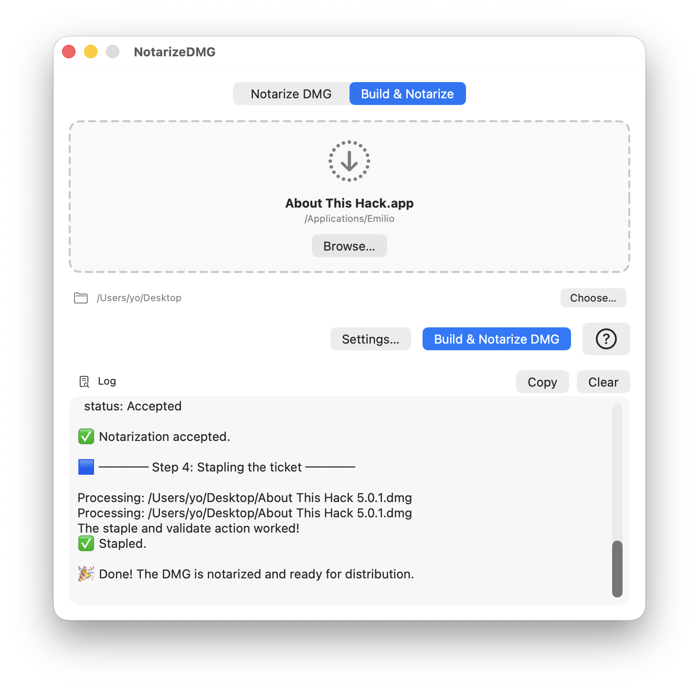

# NotarizeDMG

Una utilidad macOS en SwiftUI que notariza una imagen DMG firmada o sin firmar con Apple, todo desde una sola ventana. También integra la herramienta `create-dmg` (si está instalada) para crear un DMG con un diseño cuidado a partir de un paquete `.app` y notarizarlo en un solo paso.

|     |
|:---:|
|  |
|  |

## Características

| | |
|---|---|
| **Dos modos** | **Notarize DMG** — firma y notariza un `.dmg` existente. **Build & Notarize** — crea un DMG a partir de un `.app` con `create-dmg`, y lo firma y notariza. |
| **Arrastrar y soltar** | Arrastra un `.dmg` o `.app` a la ventana, o usa *Examinar…* para localizarlo. |
| **Carpeta de salida** | En el modo Build & Notarize, elige la carpeta donde se guardará el DMG resultante. La elección se recuerda entre sesiones. |
| **Acción en un clic** | Ejecuta `codesign`, `xcrun notarytool submit --wait` y `xcrun stapler staple` en secuencia (precedidos por `create-dmg` en el modo Build & Notarize). |
| **Cancelar** | Detén una operación en curso en cualquier momento con el botón *Cancelar*. |
| **Registro en tiempo real** | La salida de los comandos se muestra en un área de registro desplazable en tiempo real, con botones *Copiar* y *Limpiar*. |
| **Credenciales seguras** | El Apple ID, el Team ID, la identidad de firma y la contraseña específica de la aplicación se almacenan como un único elemento JSON en el Llavero del sistema, nunca en texto plano. |
| **Panel de ajustes** | Ábrelo con el botón *Ajustes…* o con ⌘, para introducir o actualizar las credenciales. |
| **Panel de ayuda** | Ayuda integrada sobre la instalación y el uso de `create-dmg`, accesible con el botón **?**. |
| **Sistema de idiomas** | Inglés (predeterminado), español, francés, alemán e italiano. Cámbialo desde el menú *Idioma* (⌘L). |

## Complemento

NotarizeDMG requiere un archivo DMG (firmado digitalmente o no) como fuente. Este DMG contiene una aplicación macOS firmada digitalmente con un Developer ID de Apple. Hay varias formas de crear la imagen DMG, incluidas las herramientas integradas de macOS, pero cuando se abre el DMG en el Finder, el diseño es muy básico, con una ventana grande e iconos pequeños.

Para crear fácilmente una imagen DMG con un aspecto más elegante, me gusta la herramienta gratuita de línea de comandos [create-dmg](https://github.com/sindresorhus/create-dmg) de *Sindresorhus*.

NotarizeDMG añade integración con `create-dmg` mediante un modo Build & Notarize que delega la creación del DMG en la CLI npm `create-dmg` ya instalada por el usuario, que produce el esperado diseño elegante de la ventana del Finder.

Muchos proyectos utilizan AppleScript para generar imágenes DMG con ventanas del Finder personalizadas, pero tiene algunas desventajas:

- No siempre funciona bien en todas las versiones de macOS compatibles
- AppleScript requiere que el usuario conceda permisos en Privacidad y Seguridad → Automatización
- Aplicar el diseño a la ventana del DMG es bastante lento.

NotarizeDMG, en cambio, al usar `create-dmg` como herramienta de creación de DMG, evita estas desventajas, no requiere permiso de Automatización y la creación de la imagen es muy rápida.

El requisito previo para tener `create-dmg` es tener instalado Node.js 20 o posterior. Una forma de instalar Node es a través del gestor de paquetes Homebrew. Aunque esto es un paso adicional en comparación con instalar Node directamente desde su propio instalador, puede ayudarte a evitar errores de permisos y otros problemas.

1️⃣ Instalar Homebrew:

```bash
/bin/bash -c "$(curl -fsSL https://raw.githubusercontent.com/Homebrew/install/HEAD/install.sh)"
```

2️⃣ Instalar Node:

`brew install node`

3️⃣ Instalar create-dmg:

- Ejecuta<br>`npm install --global create-dmg` en la Terminal
- Opcional: si recibes un mensaje sobre<br>`allow-scripts=fs-xattr,macos-alias`<br>ejecuta<br>`npm config set allow-scripts=fs-xattr,macos-alias --location=user`
- `create-dmg` estará disponible en `/usr/local/bin/create-dmg` (Mac Intel) o `/opt/homebrew/bin/create-dmg` (Mac Silicon)
- Como beneficio adicional, la imagen DMG se firma digitalmente si no lo estaba previamente.

La imagen DMG creada tiene un diseño elegante que me gusta mucho y el proceso es muy rápido:

- 2 iconos: la aplicación y el enlace a Aplicaciones
- tamaño de icono mayor
- fondo que indica arrastrar la aplicación al enlace de Aplicaciones
- tamaño de ventana ajustado al fondo
- el icono del disco abierto tiene el icono de la aplicación integrado.

|     |
|:---:|
|  |

## Requisitos

- macOS 14 Sonoma o posterior
- Xcode 15 o posterior
- Una cuenta de Apple Developer con un certificado **Developer ID Application**
- Una **contraseña específica de aplicación** generada en [appleid.apple.com](https://appleid.apple.com)

## Primeros pasos

1. Abre `NotarizeDMG.xcodeproj` en Xcode.
2. En el editor del proyecto, establece tu **Equipo** en *Signing & Capabilities*.
3. Compila y ejecuta (`⌘R`).
4. Haz clic en **Ajustes…** (o pulsa ⌘,) y rellena:
   - **Signing Identity** — la cadena completa de Acceso a Llaveros, p. ej. `Developer ID Application: Tu Nombre (XXXXXXXXXX)`
   - **Apple ID** — el correo electrónico de tu Apple ID de desarrollador
   - **Team ID** — tu identificador de equipo de 10 caracteres
   - **App-Specific Password** — generada en appleid.apple.com
5. Guarda (las credenciales se almacenan en el Llavero del sistema).
6. Modos:
   - **Modo Notarize DMG:** arrastra (o busca) un `.dmg` y haz clic en **Notarize**
   - **Modo Build & Notarize:** arrastra (o busca) un `.app`, elige una carpeta de salida y haz clic en **Build & Notarize DMG**.

## Flujos de trabajo

### Modo Notarize DMG

La aplicación ejecuta los siguientes comandos en orden:

```bash
# 1. Firma el DMG con una marca de tiempo segura (se omite si ya está firmado)
codesign --sign "<Signing Identity>" --timestamp "<ruta/al/archivo.dmg>"

# 2. Envía a Apple y espera el resultado
xcrun notarytool submit "<ruta/al/archivo.dmg>" \
    --apple-id  "<Apple ID>" \
    --password  "<App-Specific Password>" \
    --team-id   "<Team ID>" \
    --wait

# 3. Adjunta el ticket de notarización al DMG
xcrun stapler staple "<ruta/al/archivo.dmg>"
```

### Modo Build & Notarize

Se ejecuta primero un paso 0 adicional, seguido de los tres pasos de notarización anteriores:

```bash
# 0. Crea un DMG con diseño cuidado a partir del paquete .app
create-dmg "<ruta/a/App.app>" "<carpeta-de-salida>"

# Pasos 1–3: firma, notariza y engrapa el DMG resultante (igual que arriba)
```

El binario `create-dmg` se detecta automáticamente en `/usr/local/bin/create-dmg` (Intel) o `/opt/homebrew/bin/create-dmg` (Apple Silicon). Se utiliza el DMG creado más recientemente que coincida con el nombre de la aplicación en la carpeta de salida.

## Notas de seguridad

- El App Sandbox está **desactivado** (`com.apple.security.app-sandbox = false`). Esto es necesario para que la aplicación pueda invocar `codesign`, `xcrun` y `create-dmg` como procesos hijo.
- Las cuatro credenciales se almacenan como un único elemento JSON en el Llavero del sistema bajo el nombre de servicio `perez987.notarizedmg` usando `kSecAttrAccessibleWhenUnlocked`. Nunca se escriben en disco en texto plano.
- El campo de contraseña de la aplicación usa `SecureField` y nunca se registra en el log.
- Los elementos del Llavero por campo individuales de versiones anteriores se migran automáticamente al formato combinado en el primer arranque y luego se eliminan.
