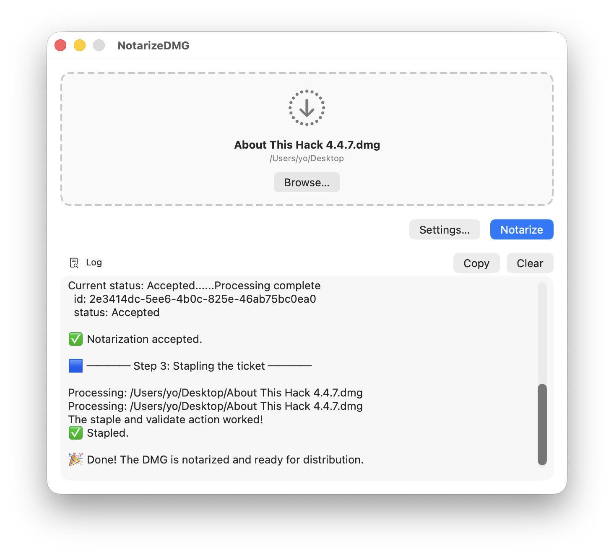
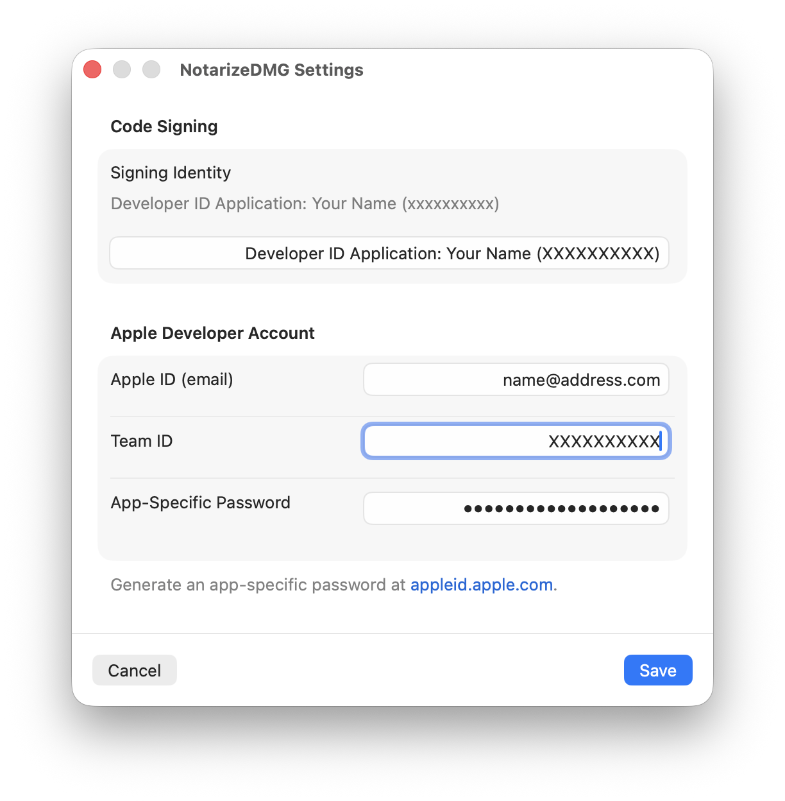
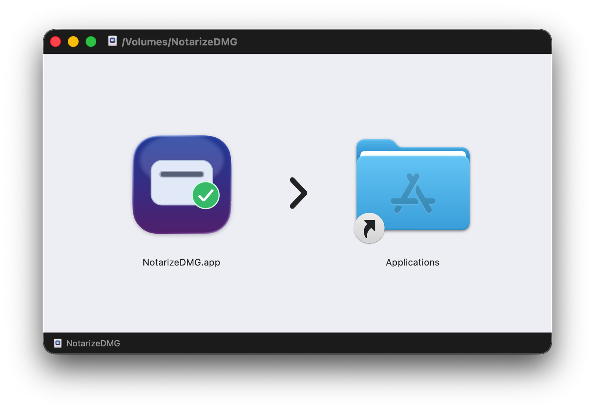

# NotarizeDMG

A macOS SwiftUI utility that notarizes a signed DMG image with Apple in three steps, all from a single window. It also signs the DMG file if it is not already digitally signed (first step).

|     |
|:---:|
|  |
|  |

## Features

| | |
|---|---|
| **Drag-and-drop** | Drop any `.dmg` onto the window or use *Browse…* to locate it. |
| **One-click notarization** | Runs `codesign`, `xcrun notarytool submit --wait`, and `xcrun stapler staple` in sequence |
| **Live log** | Command output streams into a scrollable log area in real time |
| **Secure credentials** | Apple ID, Team ID, signing identity, and app-specific password are stored in the system Keychain — never plain text |
| **Settings sheet** | Open with the *Settings…* button or ⌘, to enter / update credentials |
| **Language system** | English (default), Spanish, French, German and Italian |

## Add-on

NotarizeDMG requires a DMG file (digitally signed or not) as its source. This DMG contains a macOS application digitally signed with an Apple Development ID. There are ways to create the DMG image, including using built-in macOS tools, but when you open the DMG in the Finder window, its design is very basic, with an excessively large window and a tiny app icon.

To easily create a DMG image with a more polished look, I use the free command-line tool [create-dmg](https://github.com/sindresorhus/create-dmg) by *Sindresorhus*. Installation and use are simple:

- Prerequisite: [Node.js 20](https://nodejs.org/es) or later installed 
- Run<br>`npm install --global create-dmg` in Terminal
- Optional: If you get a message about<br>`allow-scripts=fs-xattr,macos-alias`<br>run<br>`npm config set allow-scripts=fs-xattr,macos-alias --location=user` in Terminal
- `create-dmg` is available in `/usr/local/bin/create-dmg`
- The tool can be run from Terminal with `create-dmg`
- The only required argument is the DMG filename, e.g.<br>`create-dmg NotarizeDMG 1.0.4.dmg`
- The result is created in the same folder from which you are running the tool in Terminal
- As a bonus, the DMG image is already digitally signed..

The created DMG image has an elegant design that I really like:

- 2 icons: app and Applications link
- larger icon size
- background indicating to dragg the app onto the Applications link
- window size adjusted to the background
- the open disk image icon has the application icon integrated.

|     |
|:---:|
|  |

## Requirements

- macOS 13 Ventura or later
- Xcode 15 or later
- An Apple Developer account with a **Developer ID Application** certificate
- An **app-specific password** generated at [appleid.apple.com](https://appleid.apple.com)

## Getting started

1. Open `NotarizeDMG.xcodeproj` in Xcode.
2. In the project editor, set your **Team** under *Signing & Capabilities*.
3. Build and run (`⌘R`).
4. Click **Settings…** and fill in:
   - **Signing Identity** — the full string from Keychain Access, e.g. `Developer ID Application: Your Name (XXXXXXXXXX)`
   - **Apple ID** — your developer Apple ID email
   - **Team ID** — your 10-character team identifier
   - **App-Specific Password** — generated at appleid.apple.com
5. Drop (or browse to) a signed `.dmg`, then click **Notarize**.

## Notarization workflow

The app executes the following commands in order:

```bash
# 1. Sign the DMG with a secure timestamp
codesign --sign "<Signing Identity>" --timestamp "<path/to/file.dmg>"

# 2. Submit to Apple and wait for the result
xcrun notarytool submit "<path/to/file.dmg>" \
    --apple-id  "<Apple ID>" \
    --password  "<App-Specific Password>" \
    --team-id   "<Team ID>" \
    --wait

# 3. Attach the notarization ticket to the DMG
xcrun stapler staple "<path/to/file.dmg>"
```

## Security notes

- App Sandbox is **disabled** (`com.apple.security.app-sandbox = false`). This is required so the app can invoke `codesign` and `xcrun` as child processes.
- All four credentials are stored in the system Keychain under the service name `com.notarizedmg.app` using `kSecAttrAccessibleWhenUnlocked`. They are never written to disk in plain text.
- The app password field uses `SecureField` and is never logged.
