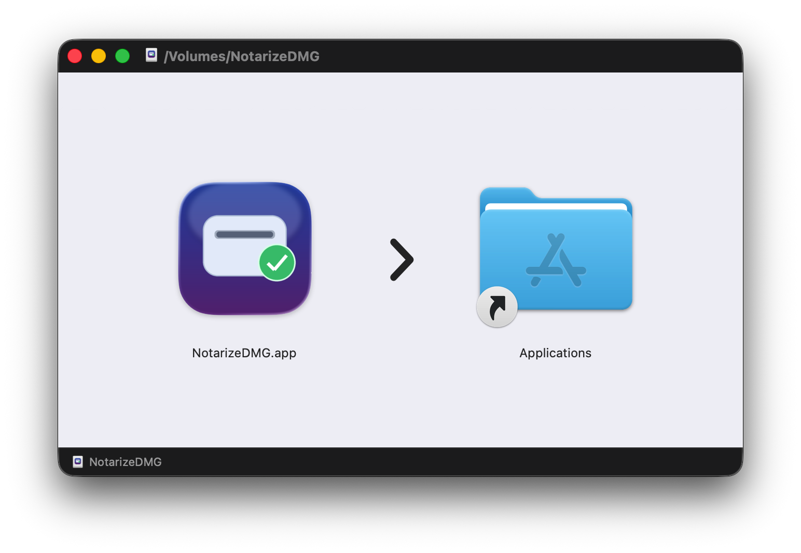

# NotarizeDMG


[](README-es.md)

  <p align="center">
     
  </p>

A macOS SwiftUI utility that notarizes a signed or unsigned DMG image with Apple, all from a single window. It also integrates the `create-dmg` tool (if installed) to build a polished DMG from a `.app` bundle and notarize it in one go.

|     |
|:---:|
|  |

## Features

| | |
|---|---|
| **Two modes** | **Notarize DMG** — sign and notarize an existing `.dmg`. **Build & Notarize** — create a DMG from a `.app` with `create-dmg`, then sign and notarize it. |
| **Drag-and-drop** | Drop a `.dmg` or `.app` onto the window, or use *Browse…* to locate it. |
| **Output folder** | In Build & Notarize mode, pick the folder where the resulting DMG will be saved. The choice is remembered between sessions. |
| **One-click action** | Runs `codesign`, `xcrun notarytool submit --wait`, and `xcrun stapler staple` in sequence (preceded by `create-dmg` in Build & Notarize mode). |
| **Cancel** | Stop a running operation at any time with the *Cancel* button. |
| **Live log** | Command output streams into a scrollable log area in real time, with *Copy* and *Clear* buttons. |
| **Secure credentials** | Apple ID, Team ID, signing identity, and app-specific password are stored as a single JSON item in the system Keychain — never plain text. |
| **Settings sheet** | Open with the *Settings…* button or ⌘, to enter / update credentials. |
| **Help sheet** | In-app help covering `create-dmg` installation and usage, opened via the **?** button. |
| **Language system** | English (default), Spanish, French, German, and Italian. Change via the *Language* menu (⌘L). |

## Add-on

NotarizeDMG requires a DMG file (digitally signed or not) as its source. This DMG contains a macOS application digitally signed with an Apple Development ID. There are ways to create the DMG image, including built-in macOS tools, but when you open the DMG in the Finder window, its design is very basic, with a large window and small icons.

To easily create a DMG image with a more elegant look, I like the free command-line tool [create-dmg](https://github.com/sindresorhus/create-dmg) by *Sindresorhus*.

NotarizeDMG adds `create-dmg` integration with a Build & Notarize mode that delegates DMG creation to the user's already-installed `create-dmg` npm CLI, which produces the expected polished Finder-window layout.

Many projects use AppleScript to generate DMG images with custom Finder windows, but it has some drawbacks:

- It doesn't always work well on all supported macOS versions
- AppleScript requires the user to grant permissions in Privacy & Security → Automation
- Applying the design to the DMG window is quite slow.

NotarizeDMG, on the other hand, by using `create-dmg` as its DMG creation tool, avoids these drawbacks, doesn't require Automation permission, and image creation is very fast.

The prerequisite to have `create-dmg` is Node.js 20 or later installed. One way to install Node is through the Homebrew package manager. While this is an extra step compared to installing Node directly from its own installer, it can help you avoid permissions errors and other issues.

1.- Install Homebrew:

```bash
/bin/bash -c "$(curl -fsSL https://raw.githubusercontent.com/Homebrew/install/HEAD/install.sh)"
```

2.- Install Node:

`brew install node`

3.- Install create-dmg:

- Run<br>`npm install --global create-dmg` in Terminal
- Optional: If you get a message about<br>`allow-scripts=fs-xattr,macos-alias`<br>run<br>`npm config set allow-scripts=fs-xattr,macos-alias --location=user`
- `create-dmg` is available in `/usr/local/bin/create-dmg` (Intel Mac) or `/opt/homebrew/bin/create-dmg` (Silicon Mac)
- As an added benefit, the DMG image is digitally signed if it wasn't signed previously.

The created DMG image has an elegant design that I really like and the process is really fast:

- 2 icons: app and Applications link
- larger icon size
- background indicating to dragg the app onto the Applications link
- window size adjusted to the background
- the open disk image icon has the application icon integrated.

|     |
|:---:|
|  |

## Requirements

- macOS 14 Sonoma or later
- Xcode 15 or later
- An Apple Developer account with a **Developer ID Application** certificate
- An **app-specific password** generated at [appleid.apple.com](https://appleid.apple.com)

## Getting started

1. Open `NotarizeDMG.xcodeproj` in Xcode.
2. In the project editor, set your **Team** under *Signing & Capabilities*.
3. Build and run (`⌘R`).
4. Click **Settings…** (or press ⌘,) and fill in:
   - **Signing Identity** — the full string from Keychain Access, e.g. `Developer ID Application: Your Name (XXXXXXXXXX)`
   - **Apple ID** — your developer Apple ID email
   - **Team ID** — your 10-character team identifier
   - **App-Specific Password** — generated at appleid.apple.com
5. Save (credentials are stored in the system Keychain).
6. Modes:
   - **Notarize DMG mode:** drop (or browse to) a `.dmg`, then click **Notarize**
   - **Build & Notarize mode:** drop (or browse to) a `.app`, choose an output folder, then click **Build & Notarize DMG**.

## Workflows

### Notarize DMG mode

The app executes the following commands in order:

```bash
# 1. Sign the DMG with a secure timestamp (skipped if already signed)
codesign --sign "<Signing Identity>" --timestamp "<path/to/file.dmg>"

# 2. Submit to Apple and wait for the result
xcrun notarytool submit "<path/to/file.dmg>" \
    --apple-id  "<Apple ID>" \
    --password  "<App-Specific Password>" \
    --team-id   "<Team ID>" \
    --wait

# 3. Attach the notarization ticket to the DMG
xcrun stapler staple "<path/to/file.dmg>"
```

### Build & Notarize mode

An extra step 1 runs first, followed by the three notarization steps above:

```bash
# 0. Build a polished DMG from the .app bundle
create-dmg "<path/to/App.app>" "<output-folder>"

# Steps 1–3: sign, notarize, and staple the resulting DMG (same as above)
```

The `create-dmg` binary is detected automatically at `/usr/local/bin/create-dmg` (Intel) or `/opt/homebrew/bin/create-dmg` (Apple Silicon). The most recently created DMG matching the app name in the output folder is used.

## Security notes

- App Sandbox is **disabled** (`com.apple.security.app-sandbox = false`). This is required so the app can invoke `codesign`, `xcrun`, and `create-dmg` as child processes.
- All four credentials are stored as a single JSON item in the system Keychain under the service name `perez987.notarizedmg` using `kSecAttrAccessibleWhenUnlocked`. They are never written to disk in plain text.
- The app password field uses `SecureField` and is never logged.
- Legacy per-field Keychain items (from earlier versions) are automatically migrated to the combined format on first launch and then deleted.
