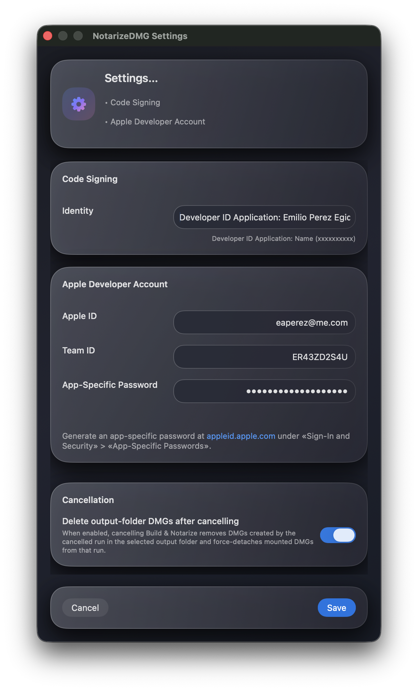

# NotarizeDMG


<!-- [](README-es.md) -->

  <p align="center">
     
  </p>

A macOS SwiftUI utility that notarizes a signed or unsigned DMG image with Apple, all from a single window. In Build & Notarize mode it prefers `create-dmg` when available and falls back to a built-in AppleScript + Finder workflow when it is not.

| AppleScript |
|:----|
|  |

| create-dmg |
|:----|
|  | 

## Features

| | |
|---|---|
| **Two modes** | **Notarize DMG** — sign and notarize an existing `.dmg`. **Build & Notarize** — create a DMG from a `.app`, then sign and notarize it, using `create-dmg` when installed or AppleScript + Finder as a fallback. |
| **Drag-and-drop** | Drop a `.dmg` or `.app` onto the window, or use *Browse…* to locate it. |
| **Output folder** | In Build & Notarize mode, pick the folder where the resulting DMG will be saved. The choice is remembered between sessions. |
| **One-click action** | Runs `codesign`, `xcrun notarytool submit --wait`, and `xcrun stapler staple` in sequence (preceded by either `create-dmg` or the built-in AppleScript DMG builder in Build & Notarize mode). |
| **Cancel** | Stop a running operation at any time with the *Cancel* button. |
| **Live log** | Command output streams into a scrollable log area in real time, with *Copy* and *Clear* buttons. |
| **Secure credentials** | Apple ID, Team ID, signing identity, and app-specific password are stored as a single JSON item in the system Keychain — never plain text. |
| **Settings sheet** | Open with the *Settings…* button or ⌘, to enter / update credentials. |
| **Help sheet** | In-app help covering both DMG creation paths and `create-dmg` installation, opened via the **?** button. |
| **Language system** | English (default), Spanish, French, German, and Italian. Change via the *Language* menu (⌘L). |

## Add-on

NotarizeDMG requires a DMG file (digitally signed or not) as its source. This DMG contains a macOS application digitally signed with an Apple Development ID. There are ways to create the DMG image, including built-in macOS tools, but when you open the DMG in the Finder window, its design is very basic, with a large window and small icons.

To easily create a DMG image with a more elegant look, I like the free command-line tool [create-dmg](https://github.com/sindresorhus/create-dmg) by *Sindresorhus*.

NotarizeDMG adds `create-dmg` integration with a Build & Notarize mode that delegates DMG creation to the user's already-installed `create-dmg` npm CLI when available, and otherwise falls back to a built-in AppleScript + Finder workflow.

Many projects use AppleScript to generate DMG images with custom Finder windows, but it has some drawbacks:

- It doesn't always work well on all supported macOS versions
- AppleScript requires the user to grant permissions in Privacy & Security → Automation
- Applying the design to the DMG window is quite slow.

When `create-dmg` is installed, NotarizeDMG uses that faster path and avoids Finder Automation permission entirely. When it is not installed, the app still works through the built-in AppleScript fallback, though macOS may request Finder Automation permission.

The prerequisite to have `create-dmg` is Node.js 20 or later installed. One way to install Node is through the Homebrew package manager. While this is an extra step compared to installing Node directly from its own installer, it can help you avoid permissions errors and other issues.

1.- Install Homebrew:

```bash
/bin/bash -c "$(curl -fsSL https://raw.githubusercontent.com/Homebrew/install/HEAD/install.sh)"
```

2.- Install Node:

`brew install node`

3.- Install create-dmg:

- Run<br>`npm install --global create-dmg`
- Optional: If you get a message about<br>`allow-scripts=fs-xattr,macos-alias`<br>run<br>`npm config set allow-scripts=fs-xattr,macos-alias --location=user`
- `create-dmg` is available in `/usr/local/bin/create-dmg` (Intel Mac) or `/opt/homebrew/bin/create-dmg` (Silicon Mac)
- As an added benefit, the DMG image is digitally signed if it wasn't signed previously.

The created DMG image has an elegant design that I really like and the process is really fast:

- 2 icons: app and Applications link
- larger icon size
- background indicating to dragg the app onto the Applications link
- window size adjusted to the background
- the open disk image icon has the application icon integrated.

| AppleScript |
|:----|
|  |

| create-dmg |
|:----|
|  | 

### Notes

- Try the app "as is", without installing `create-dmg`. If you get stylized DMGs with an attractive Finder window layout, stick with that. If the DMGs have the basic, ugly Finder window layout typical of standard DMGs, install `create-dmg`: the DMG creation process is significantly faster, you don't need to grant automation permissions, and the DMG images will always feature an enhanced Finder window layout
- The first time you run the application in AppleScript mode, a prompt informs to the user that "DMGBuildNotarize uses Finder automation to create custom installer window layouts" and asking for permission to allow DMGBuildNotarize to send Apple Events to Finder. You must grant this permission for the DMG to be created correctly. This is not necessary if the DMG is created in create-dmg mode
- Why is the background of the DMG's Finder window different?
   - AppleScript: the window background is generated via code; what you see is the result of trial-and-error adjustments until I found a valid one
   - create-dmg: the background is embedded as an image within the tool; since it is used in many different projects, I preferred to keep the original background exactly as implemented by its creator, *sindresorhus*.

## create-dmg Help

If the app does not detect `create-dmg` on the system, Build & Notarize automatically switches to the built-in AppleScript fallback and the UI explains that Finder Automation permission may be requested. The Help icon (?) displays an information window about the two operating modes of NotarizeDMG.

## Settings

The Settings window consolidates the following settings in one place:

- Code signing and Apple Developer account
- Option to delete output DMGs after cancellation
- The language selection window remains a separate setting

|  |
|:----|
|  |


## Requirements

- macOS 14 Sonoma or later
- Xcode 15 or later
- An Apple Developer account with a **Developer ID Application** certificate
- An **app-specific password** generated at [appleid.apple.com](https://appleid.apple.com)

## Getting started

1. Open `NotarizeDMG.xcodeproj` in Xcode.
2. In the project editor, set your **Team** under *Signing & Capabilities*.
3. Build and run (`⌘R`).
4. Click **Settings…** (or press ⌘,) and fill in:
   - **Signing Identity** — the full string from Keychain Access, e.g. `Developer ID Application: Your Name (XXXXXXXXXX)`
   - **Apple ID** — your developer Apple ID email
   - **Team ID** — your 10-character team identifier
   - **App-Specific Password** — generated at appleid.apple.com
5. Save (credentials are stored in the system Keychain).
6. Modes:
   - **Notarize DMG mode:** drop (or browse to) a `.dmg`, then click **Notarize**
   - **Build & Notarize mode:** drop (or browse to) a `.app`, choose an output folder, then click **Build & Notarize DMG**.

## Notarization workflow

The app executes the following commands in order:

```bash
# 1. Sign the DMG with a secure timestamp (skipped if already signed)
codesign --sign "<Signing Identity>" --timestamp "<path/to/file.dmg>"

# 2. Submit to Apple and wait for the result
xcrun notarytool submit "<path/to/file.dmg>" \
    --apple-id  "<Apple ID>" \
    --password  "<App-Specific Password>" \
    --team-id   "<Team ID>" \
    --wait

# 3. Attach the notarization ticket to the DMG
xcrun stapler staple "<path/to/file.dmg>"
```
Before the notarization workflow → The `create-dmg` binary is detected automatically at `/usr/local/bin/create-dmg` (Intel) or `/opt/homebrew/bin/create-dmg` (Apple Silicon). If it is not found, NotarizeDMG mounts a temporary writable DMG, applies the Finder window layout with AppleScript, compresses the image, and continues with signing, notarization, and stapling.

## Security notes

- App Sandbox is **disabled** (`com.apple.security.app-sandbox = false`). This is required so the app can invoke `codesign`, `xcrun`, `create-dmg`, `hdiutil`, and Finder automation as child operations.
- All four credentials are stored as a single JSON item in the system Keychain under the service name `perez987.notarizedmg` using `kSecAttrAccessibleWhenUnlocked`. They are never written to disk in plain text.
- The app password field uses `SecureField` and is never logged.
- Legacy per-field Keychain items (from earlier versions) are automatically migrated to the combined format on first launch and then deleted.
